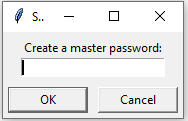
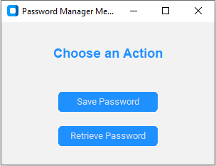
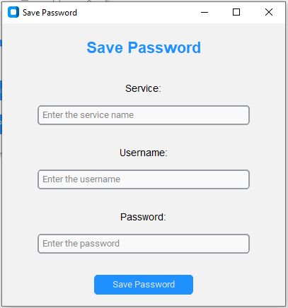
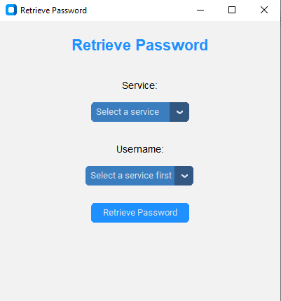

# PasswordManager
This is Beautiful Software to manage all the passwords in an organized manner. Now You Don't Need to remember multiple passwords. This program will handle all. Only you have to update passwords in this program.

<b> On First Run </b>
 
<b> Main Screen </b>
 
<b> Saving Screen </b>
 
<b> Retrieve Screen </b>

